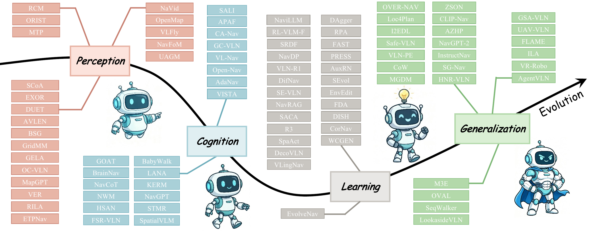

<p align="center">
  <h1 align="center">Awesome Vision-and-Language Navigation Evolution</h1>
  <p align="center"><strong>Curated resources for VLN evolution from instruction following to cognitive navigation.</strong></p>
</p>

<p align="center">
  <a href="https://awesome.re"></a>
  <a href="https://github.com/lvkailin0118/Awesome-VLN-Evolution"></a>
  <a href="https://github.com/lvkailin0118/Awesome-VLN-Evolution/commits/main"></a>
  <a href="https://github.com/lvkailin0118/Awesome-VLN-Evolution/pulls"></a>
</p>

<p align="center">
  <a href="#perception-evolution"></a>
  <a href="#cognition-evolution"></a>
  <a href="#learning-evolution"></a>
  <a href="#generalization-evolution"></a>
  
</p>

This repository curates papers and resources for the evolution of Vision-and-Language Navigation (VLN), following the survey perspective from instruction following toward cognitive navigation.

The list is organized by four progressive dimensions: **Perception**, **Cognition**, **Learning**, and **Generalization**. Entries are derived from the survey figures in our draft and are sorted by year from newest to oldest within each section.

## Overview

- [Latest Updates](#latest-updates)
- [Evolution Overview](#evolution-overview)
- [Section Guide](#section-guide)
- [Perception Evolution](#perception-evolution)
- [Cognition Evolution](#cognition-evolution)
- [Learning Evolution](#learning-evolution)
- [Generalization Evolution](#generalization-evolution)
- [Citation and Contributions](#citation-and-contributions)

## Latest Updates

- 2026-06-14: Polished the awesome-list presentation with the survey overview figure, GitHub-star code badges, a section guide, and contribution guidance.
- 2026-06-13: Released the initial survey list with 254 entries from Fig. 3, Fig. 5, Fig. 7, and Fig. 9 of the VLN evolution survey draft.

## Evolution Overview

<p align="center">
  
</p>

The collection follows the survey's four-axis view of VLN development: perception grounds instructions in embodied scenes, cognition structures spatial reasoning and planning, learning improves behavior through supervision and feedback, and generalization pushes navigation toward open-world deployment.

Repository badges point to verified open-source code. Project pages, datasets, leaderboards, and demos are listed in `Research Direction / Resource`; entries without a confirmed code release use `---`.

## Section Guide

| Dimension | Focus | Entries |
|:----------|-------|:-------:|
| [Perception Evolution](#perception-evolution) | Visual grounding, semantic landmarks, open-vocabulary maps, BEV/3D/topological structure, and streaming or multi-source perception. | 57 |
| [Cognition Evolution](#cognition-evolution) | Instruction abstraction, spatial reasoning, explicit reasoning traces, robust planning, imagination, and world-action modeling. | 58 |
| [Learning Evolution](#learning-evolution) | Imitation learning, VLM/VLA alignment, reward-driven post-training, runtime correction, self-evolution, and scalable data regimes. | 68 |
| [Generalization Evolution](#generalization-evolution) | Zero-shot navigation, long-horizon planning, agentic reasoning, lifelong deployment, outdoor/aerial scale-up, robustness, and social navigation. | 71 |

**Legend.** `Paper Title` links to the paper page, PDF, arXiv, or publisher record. `Repository` is reserved for open-source code and uses GitHub-star badges when available. `Research Direction / Resource` records the survey subdirection and may include project, dataset, benchmark, or leaderboard links.

## Perception Evolution

From holistic visual grounding to semantic anchors, embodied spatial structures, and situated sensory streams.

| Year | Paper Title | Repository | Research Direction / Resource |
|:----:|-------------|:----------:|------|
| 2026 | [CMMR-VLN: Vision-and-Language Navigation via Continual Multimodal Memory Retrieval](https://arxiv.org/abs/2603.07997) | --- | Topological Spatial Perception |
| 2026 | [TagaVLM: Topology-Aware Global Action Reasoning for Vision-Language Navigation](https://arxiv.org/abs/2603.02972) | --- | Topological Spatial Perception |
| 2026 | [Uncertainty-aware gaussian map for vision-language navigation](https://openreview.net/forum?id=LPv59noPAy) | [](https://github.com/Gaozzzz/Uncertainty-Aware-VLN) | 3D Representation / 3DGS |
| 2026 | [Monodream: Monocular vision-language navigation with panoramic dreaming](https://doi.org/10.48448/nqzj-ce90) | --- | Video / Streaming Perception |
| 2026 | [VLN-Cache: Enabling Token Caching for VLN Models with Visual/Semantic Dynamics Awareness](https://arxiv.org/abs/2603.07080) | --- | Video / Streaming Perception |
| 2026 | [DeCoNav: Dialog enhanced Long-Horizon Collaborative Vision-Language Navigation](https://arxiv.org/abs/2604.12486) | --- | Multi-Source Perception |
| 2025 | [Generating Vision-Language Navigation Instructions Incorporated Fine-Grained Alignment Annotations](https://doi.org/10.1016/j.inffus.2025.104107) | --- | Object / Landmark Grounding |
| 2025 | [GroundingMate: Aiding Object Grounding for Goal-Oriented Vision-and-Language Navigation](https://doi.org/10.1109/wacv61041.2025.00180) | --- | Region / Scene-Level Perception |
| 2025 | [Ovl-map: An online visual language map approach for vision-and-language navigation in continuous environments](https://doi.org/10.1109/lra.2025.3540577) | [](https://github.com/ai4ce/OVL-MAP) | Open-Vocabulary Entities |
| 2025 | [OpenMap: Instruction Grounding via Open-Vocabulary Visual-Language Mapping](https://doi.org/10.1145/3746027.3754887) | --- | Open-Vocabulary Entities |
| 2025 | [Grounded vision-language navigation for uavs with open-vocabulary goal understanding](https://arxiv.org/abs/2506.10756) | --- | Open-Vocabulary Entities |
| 2025 | [Mapnav: A novel memory representation via annotated semantic maps for vlm-based vision-and-language navigation](https://arxiv.org/pdf/2502.13451) | --- | BEV / Map-Based Representation |
| 2025 | [3d gaussian map with open-set semantic grouping for vision-language navigation](https://doi.org/10.1109/iccv51701.2025.00864) | [](https://github.com/Gaozzzz/3D-Gaussian-Map-VLN) | 3D Representation / 3DGS |
| 2025 | [Towards Physically Executable 3D Gaussian for Embodied Navigation](https://arxiv.org/abs/2510.21307) | --- | 3D Representation / 3DGS |
| 2025 | [Streamvln: Streaming vision-and-language navigation via slowfast context modeling](https://arxiv.org/abs/2507.05240) | [](https://github.com/prevseg/StreamVLN) | Video / Streaming Perception; [project](https://streamvln.github.io/) |
| 2025 | [Efficient-VLN: A Training-Efficient Vision-Language Navigation Model](https://arxiv.org/abs/2512.10310) | --- | Video / Streaming Perception |
| 2025 | [Embodied navigation foundation model](https://arxiv.org/abs/2509.12129) | --- | Video / Streaming Perception; [project](https://pku-epic.github.io/NavFoM-Web/) |
| 2025 | [DialNav: Multi-turn Dialog Navigation with a Remote Guide](https://arxiv.org/pdf/2509.12894) | --- | Multi-Source Perception |
| 2024 | [Correctable landmark discovery via large models for vision-language navigation](https://doi.org/10.1109/tpami.2024.3407759) | --- | Object / Landmark Grounding |
| 2024 | [Nl-slam for oc-vln: Natural language grounded slam for object-centric vln](https://arxiv.org/abs/2411.07848) | --- | Region / Scene-Level Perception |
| 2024 | [Over-nav: Elevating iterative vision-and-language navigation with open-vocabulary detection and structured representation](https://doi.org/10.1109/cvpr52733.2024.01542) | [](https://github.com/KTH-RPL/OneMap) | Open-Vocabulary Entities; [project](https://kth-rpl.github.io/OneMap/) |
| 2024 | [Instructnav: Zero-shot system for generic instruction navigation in unexplored environment](https://arxiv.org/abs/2406.04882) | [](https://github.com/LYX0501/InstructNav) | Open-Vocabulary Entities; [project](https://lyx0501.github.io/InstructNav/) |
| 2024 | [Etpnav: Evolving topological planning for vision-language navigation in continuous environments](https://arxiv.org/abs/2304.03047v2) | [](https://github.com/MarSaKi/ETPNav) | Topological Spatial Perception |
| 2024 | [Mapgpt: Map-guided prompting with adaptive path planning for vision-and-language navigation](https://arxiv.org/abs/2401.07314) | [](https://github.com/chen-judge/MapGPT) | Topological Spatial Perception; [project](https://chen-judge.github.io/MapGPT/) |
| 2024 | [Volumetric environment representation for vision-language navigation](https://arxiv.org/pdf/2403.14158) | [](https://github.com/kevin-rohling/VER) | 3D Representation / 3DGS |
| 2024 | [Lookahead exploration with neural radiance representation for continuous vision-language navigation](https://arxiv.org/pdf/2404.01943) | [](https://github.com/MrZihan/HNR-VLN) | 3D Representation / 3DGS |
| 2024 | [Unitedvln: Generalizable gaussian splatting for continuous vision-language navigation](https://arxiv.org/abs/2411.16053) | --- | 3D Representation / 3DGS |
| 2024 | [Navid: Video-based vlm plans the next step for vision-and-language navigation](https://arxiv.org/abs/2402.15852) | [](https://github.com/jzhzhang/NaVid-VLN-CE) | Video / Streaming Perception; [project](https://pku-epic.github.io/NaVid/) |
| 2024 | [Uni-navid: A video-based vision-language-action model for unifying embodied navigation tasks](https://arxiv.org/abs/2412.06224) | [](https://github.com/jzhzhang/Uni-NaVid) | Video / Streaming Perception; [project](https://pku-epic.github.io/Uni-NaVid/) |
| 2024 | [Caven: An embodied conversational agent for efficient audio-visual navigation in noisy environments](https://ojs.aaai.org/index.php/AAAI/article/download/28167/28333) | --- | Multi-Source Perception |
| 2024 | [Rila: Reflective and imaginative language agent for zero-shot semantic audio-visual navigation](https://doi.org/10.1109/cvpr52733.2024.01538) | --- | Multi-Source Perception |
| 2024 | [Human-aware vision-and-language navigation: Bridging simulation to reality with dynamic human interactions](https://doi.org/10.52202/079017-3795) | [](https://github.com/lpercc/HA-VLN) | Multi-Source Perception; [project](https://ha-vln-project.vercel.app/) |
| 2023 | [Grounded entity-landmark adaptive pre-training for vision-and-language navigation](https://arxiv.org/abs/2308.12587) | [](https://github.com/CSir1996/VLN-GELA) | Object / Landmark Grounding |
| 2023 | [Bird's-eye-view scene graph for vision-language navigation](https://arxiv.org/abs/2308.04758) | --- | BEV / Map-Based Representation |
| 2023 | [Gridmm: Grid memory map for vision-and-language navigation](https://openaccess.thecvf.com/content/ICCV2023/html/Wang_GridMM_Grid_Memory_Map_for_Vision-and-Language_Navigation_ICCV_2023_paper.html) | --- | BEV / Map-Based Representation |
| 2023 | [Co-navgpt: Multi-robot cooperative visual semantic navigation using large language models](https://arxiv.org/abs/2310.07937) | --- | Multi-Source Perception |
| 2022 | [Less is more: Generating grounded navigation instructions from landmarks](https://arxiv.org/pdf/2004.14973) | [](https://github.com/google-research-datasets/RxR/tree/main/marky-mT5) | Object / Landmark Grounding |
| 2022 | [Explicit object relation alignment for vision and language navigation](https://aclanthology.org/2022.acl-srw.24.pdf) | --- | Object / Landmark Grounding |
| 2022 | [Think global, act local: Dual-scale graph transformer for vision-and-language navigation](https://arxiv.org/pdf/2202.11742) | --- | Region / Scene-Level Perception; Topological Spatial Perception |
| 2022 | [Cross-modal map learning for vision and language navigation](https://openaccess.thecvf.com/content/CVPR2022/html/Georgakis_Cross-Modal_Map_Learning_for_Vision_and_Language_Navigation_CVPR_2022_paper.html) | --- | BEV / Map-Based Representation |
| 2022 | [Weakly-supervised multi-granularity map learning for vision-and-language navigation](https://arxiv.org/pdf/2210.07506) | --- | BEV / Map-Based Representation |
| 2022 | [Avlen: Audio-visual-language embodied navigation in 3d environments](https://doi.org/10.52202/068431-0451) | --- | Multi-Source Perception |
| 2021 | [Vln bert: A recurrent vision-and-language bert for navigation](https://openaccess.thecvf.com/content/CVPR2021/papers/Hong_VLN_BERT_A_Recurrent_Vision-and-Language_BERT_for_Navigation_CVPR_2021_paper.pdf) | [](https://github.com/YicongHong/Recurrent-VLN-BERT) | Holistic View Grounding |
| 2021 | [The road to know-where: An object-and-room informed sequential bert for indoor vision-language navigation](https://openaccess.thecvf.com/content/ICCV2021/papers/Qi_The_Road_To_Know-Where_An_Object-and-Room_Informed_Sequential_BERT_for_ICCV_2021_paper.pdf) | [](https://github.com/YuankaiQi/ORIST) | Object / Landmark Grounding |
| 2021 | [Landmark-rxr: Solving vision-and-language navigation with fine-grained alignment supervision](https://papers.nips.cc/paper/2021/hash/0602940f23884f782058efac46f64b0f-Abstract.html) | --- | Object / Landmark Grounding |
| 2021 | [Soon: Scenario oriented object navigation with graph-based exploration](https://openaccess.thecvf.com/content/CVPR2021/papers/Zhu_SOON_Scenario_Oriented_Object_Navigation_With_Graph-Based_Exploration_CVPR_2021_paper.pdf) | [](https://github.com/ZhuFengdaaa/SOON) | Region / Scene-Level Perception |
| 2021 | [Topological planning with transformers for vision-and-language navigation](https://doi.org/10.1109/cvpr46437.2021.01112) | --- | Topological Spatial Perception |
| 2021 | [Self-motivated communication agent for real-world vision-dialog navigation](https://openaccess.thecvf.com/content/ICCV2021/html/Zhu_Self-Motivated_Communication_Agent_for_Real-World_Vision-Dialog_Navigation_ICCV_2021_paper.html) | --- | Multi-Source Perception |
| 2020 | [Towards learning a generic agent for vision-and-language navigation via pre-training](https://arxiv.org/abs/2002.10638) | [](https://github.com/weituo12321/PREVALENT) | Holistic View Grounding |
| 2020 | [Reverie: Remote embodied visual referring expression in real indoor environments](https://openaccess.thecvf.com/content_CVPR_2020/papers/Qi_REVERIE_Remote_Embodied_Visual_Referring_Expression_in_Real_Indoor_Environments_CVPR_2020_paper.pdf) | [](https://github.com/YuankaiQi/REVERIE) | Region / Scene-Level Perception |
| 2020 | [Beyond the nav-graph: Vision-and-language navigation in continuous environments](https://arxiv.org/abs/2004.02857) | [](https://github.com/jacobkrantz/VLN-CE) | BEV / Map-Based Representation |
| 2020 | [Soundspaces: Audio-visual navigation in 3d environments](https://doi.org/10.1007/978-3-030-58539-6_2) | --- | Multi-Source Perception |
| 2020 | [Vision-and-dialog navigation](https://arxiv.org/pdf/1907.04957) | [](https://github.com/mmurray/cvdn) | Multi-Source Perception; [project](https://cvdn.dev/) |
| 2019 | [Self-monitoring navigation agent via auxiliary progress estimation](https://arxiv.org/abs/1901.03035) | --- | Holistic View Grounding |
| 2019 | [Reinforced cross-modal matching and self-supervised imitation learning for vision-language navigation](https://doi.org/10.1109/cvpr.2019.00679) | --- | Holistic View Grounding |
| 2018 | [Vision-and-language navigation: Interpreting visually-grounded navigation instructions in real environments](https://openaccess.thecvf.com/content_cvpr_2018/papers/Anderson_Vision-and-Language_Navigation_Interpreting_CVPR_2018_paper.pdf) | [](https://github.com/peteanderson80/Matterport3DSimulator) | Holistic View Grounding; [project](https://bringmeaspoon.org/) |
| 2018 | [Speaker-follower models for vision-and-language navigation](https://arxiv.org/pdf/1806.02724) | [](https://github.com/ronghanghu/speaker_follower) | Holistic View Grounding; [project](https://ronghanghu.com/speaker_follower/) |

## Cognition Evolution

From instruction abstraction and spatial reasoning to explicit planning, future imagination, and world-action modeling.

| Year | Paper Title | Repository | Research Direction / Resource |
|:----:|-------------|:----------:|------|
| 2026 | [DroneNav: Unified text-visual representation and structured spatial reasoning for robust UAV vision-and-language navigation](https://doi.org/10.1016/j.neucom.2026.133492) | --- | Spatial Relation Reasoning |
| 2026 | [Spatial-VLN: Zero-Shot Vision-and-Language Navigation With Explicit Spatial Perception and Exploration](https://arxiv.org/abs/2601.12766) | --- | Spatial Relation Reasoning |
| 2026 | [Msnav: Zero-shot vision-and-language navigation with dynamic memory and llm spatial reasoning](https://doi.org/10.1109/icassp55912.2026.11463005) | --- | Memory-Augmented Spatial Inference |
| 2026 | [SpatialNav: Leveraging Spatial Scene Graphs for Zero-Shot Vision-and-Language Navigation](https://arxiv.org/abs/2601.06806) | --- | Memory-Augmented Spatial Inference |
| 2026 | [HiMemVLN: Enhancing Reliability of Open-Source Zero-Shot Vision-and-Language Navigation with Hierarchical Memory System](https://arxiv.org/abs/2603.14807) | --- | Explicit Reasoning Traces |
| 2026 | [CoT-VLNBench: A Benchmark for Visual Chain-of-Thought Reasoning in Vision-Language-Navigation Robots](https://ojs.aaai.org/index.php/AAAI/article/view/40980) | [](https://github.com/Hz0124/CoT-VLNBench) | Explicit Reasoning Traces |
| 2026 | [FantasyVLN: Unified Multimodal Chain-of-Thought Reasoning for Vision-Language Navigation](https://arxiv.org/abs/2601.13976) | --- | Explicit Reasoning Traces |
| 2026 | [ProFocus: Proactive Perception and Focused Reasoning in Vision-and-Language Navigation](https://arxiv.org/abs/2603.05530) | [](https://github.com/xf-zhao/ProFocus) | Self-Monitoring and Robust Planning; [project](https://xf-zhao.github.io/ProFocus/) |
| 2026 | [Stop Wandering: Efficient Vision-Language Navigation via Metacognitive Reasoning](https://arxiv.org/abs/2604.02318) | --- | Self-Monitoring and Robust Planning |
| 2026 | [DecoVLN: Decoupling Observation, Reasoning, and Correction for Vision-and-Language Navigation](https://arxiv.org/abs/2603.13133) | [](https://github.com/Allenxinn/DecoVLN) | Self-Monitoring and Robust Planning; [project](https://allenxinn.github.io/DecoVLN/) |
| 2026 | [EvolveNav: Empowering LLM-Based Vision-Language Navigation via Self-Improving Embodied Reasoning](https://arxiv.org/pdf/2506.01551) | --- | Self-Monitoring and Robust Planning |
| 2026 | [MapDream: Task-Driven Map Learning for Vision-Language Navigation](https://arxiv.org/abs/2602.00222) | --- | Future Prediction and Visual Imagination |
| 2026 | [ThinkMatter: Panoramic-Aware Instructional Semantics for Monocular Vision-and-Language Navigation](https://ink.library.smu.edu.sg/sis_research/10905) | --- | Future Prediction and Visual Imagination |
| 2026 | [UNeMo: Collaborative Visual-Language Reasoning and Navigation via a Multimodal World Model](https://arxiv.org/pdf/2511.18845) | --- | Foundation-Model World Models |
| 2026 | [PROSPECT: Unified Streaming Vision-Language Navigation via Semantic--Spatial Fusion and Latent Predictive Representation](https://arxiv.org/abs/2603.03739) | --- | Foundation-Model World Models |
| 2026 | [WorldMAP: Bootstrapping Vision-Language Navigation Trajectory Prediction with Generative World Models](https://arxiv.org/abs/2604.07957) | --- | Foundation-Model World Models |
| 2026 | [Dual-Anchoring: Addressing State Drift in Vision-Language Navigation](https://arxiv.org/abs/2604.17473) | --- | Foundation-Model World Models |
| 2026 | [World Action Models are Zero-shot Policies](https://arxiv.org/abs/2602.15922) | --- | Toward World-Action Models |
| 2026 | [Fast-WAM: Do World Action Models Need Test-time Future Imagination?](https://arxiv.org/abs/2603.16666) | --- | Toward World-Action Models |
| 2026 | [GigaWorld-Policy: An Efficient Action-Centered World--Action Model](https://arxiv.org/abs/2603.17240) | --- | Toward World-Action Models |
| 2026 | [Latent-WAM: Latent World Action Modeling for End-to-End Autonomous Driving](https://arxiv.org/abs/2603.24581) | --- | Toward World-Action Models |
| 2026 | [DriveDreamer-Policy: A Geometry-Grounded World-Action Model for Unified Generation and Planning](https://arxiv.org/abs/2604.01765) | --- | Toward World-Action Models |
| 2025 | [A multilevel attention network with sub-instructions for continuous vision-and-language navigation: Z. He et al.](https://doi.org/10.1007/s10489-025-06544-9) | --- | Fine-Grained Instruction Decomposition |
| 2025 | [Action-Aware Visual-Textual Alignment for Long-Instruction Vision-and-Language Navigation](https://doi.org/10.1145/3748656) | --- | Fine-Grained Instruction Decomposition |
| 2025 | [Progress-Think: Semantic Progress Reasoning for Vision-Language Navigation](https://arxiv.org/abs/2511.17097) | --- | Fine-Grained Instruction Decomposition |
| 2025 | [Constraint-aware zero-shot vision-language navigation in continuous environments](https://doi.org/10.1109/tpami.2025.3594204) | --- | Structured Instruction Constraints |
| 2025 | [GC-VLN: Instruction as graph constraints for training-free vision-and-language navigation](https://arxiv.org/abs/2509.10454) | [](https://github.com/bagh2178/GC-VLN) | Structured Instruction Constraints; [project](https://bagh2178.github.io/GC-VLN/) |
| 2025 | [Uav-vln: End-to-end vision language guided navigation for uavs](https://arxiv.org/pdf/2504.21432) | [](https://github.com/sachinsaxena01/UAV-VLN) | Structured Instruction Constraints |
| 2025 | [Structured Instruction Parsing and Scene Alignment For UAV Vision-Language Navigation](https://doi.org/10.1109/icip55913.2025.11084696) | --- | Structured Instruction Constraints |
| 2025 | [Citynavagent: Aerial vision-and-language navigation with hierarchical semantic planning and global memory](https://aclanthology.org/2025.acl-long.1511.pdf) | --- | Structured Instruction Constraints |
| 2025 | [Breaking down and building up: Mixture of skill-based vision-and-language navigation agents](https://arxiv.org/abs/2508.07642) | --- | Structured Instruction Constraints |
| 2025 | [Endowing embodied agents with spatial reasoning capabilities for vision-and-language navigation](https://arxiv.org/abs/2504.08806) | --- | Spatial Relation Reasoning |
| 2025 | [Vl-nav: real-time vision-language navigation with spatial reasoning](https://arxiv.org/abs/2502.00931) | --- | Spatial Relation Reasoning; [project](https://sairlab.org/vlnav/) |
| 2025 | [Open-nav: Exploring zero-shot vision-and-language navigation in continuous environment with open-source llms](https://arxiv.org/pdf/2409.18794) | [](https://github.com/YanyuanQiao/Open-Nav) | Memory-Augmented Spatial Inference; [project](https://sites.google.com/view/opennav) |
| 2025 | [SpatialGPT: Zero-Shot Vision-and-Language Navigation via Spatial CoT over Structured Spatial Memory](https://dl.acm.org/doi/pdf/10.1145/3748636.3762753) | --- | Memory-Augmented Spatial Inference |
| 2025 | [FSR-VLN: Fast and Slow Reasoning for Vision-Language Navigation with Hierarchical Multi-modal Scene Graph](https://arxiv.org/abs/2509.13733) | [](https://github.com/HorizonRobotics/HoloAgent) | Memory-Augmented Spatial Inference; Self-Monitoring and Robust Planning; [project](https://horizonrobotics.github.io/robot_lab/fsr-vln/) |
| 2025 | [Navcot: Boosting llm-based vision-and-language navigation via learning disentangled reasoning](https://arxiv.org/abs/2403.07376) | [](https://github.com/expectorlin/NavCoT) | Explicit Reasoning Traces |
| 2025 | [Aux-think: Exploring reasoning strategies for data-efficient vision-language navigation](https://arxiv.org/abs/2505.11886) | --- | Explicit Reasoning Traces |
| 2025 | [AdaNav: Adaptive Reasoning with Uncertainty for Vision-Language Navigation](https://arxiv.org/abs/2509.24387) | --- | Self-Monitoring and Robust Planning |
| 2025 | [Hierarchical semantic-augmented navigation: Optimal transport and graph-driven reasoning for vision-language navigation](https://openreview.net/forum?id=ypVW5jvguX) | --- | Self-Monitoring and Robust Planning |
| 2025 | [Navigation world models](https://openaccess.thecvf.com/content/CVPR2025/html/Bar_Navigation_World_Models_CVPR_2025_paper.html) | --- | Future Prediction and Visual Imagination |
| 2025 | [Planning from imagination: Episodic simulation and episodic memory for vision-and-language navigation](https://ojs.aaai.org/index.php/AAAI/article/download/32679/34834) | --- | Future Prediction and Visual Imagination |
| 2025 | [Do visual imaginations improve vision-and-language navigation agents?](https://arxiv.org/pdf/2503.16394) | --- | Future Prediction and Visual Imagination |
| 2025 | [Vista: Generative visual imagination for vision-and-language navigation](https://arxiv.org/abs/2505.07868) | [](https://github.com/Huang-Jingyu/VISTA) | Future Prediction and Visual Imagination; [project](https://huang-jingyu.github.io/VISTA/) |
| 2025 | [NavForesee: A Unified Vision-Language World Model for Hierarchical Planning and Dual-Horizon Navigation Prediction](https://arxiv.org/abs/2512.01550) | --- | Foundation-Model World Models |
| 2025 | [AstraNav-World: World Model for Foresight Control and Consistency](https://arxiv.org/abs/2512.21714) | --- | Foundation-Model World Models |
| 2025 | [CVLN-Think: Causal Inference with Counterfactual Style Adaptation for Continuous Vision-and-Language Navigation](https://doi.org/10.1109/iros60139.2025.11247004) | --- | Foundation-Model World Models |
| 2024 | [Exploring spatial representation to enhance LLM reasoning in aerial vision-language navigation](https://arxiv.org/abs/2410.08500) | --- | Structured Instruction Constraints |
| 2024 | [Spatialvlm: Endowing vision-language models with spatial reasoning capabilities](https://doi.org/10.1109/cvpr52733.2024.01370) | --- | Spatial Relation Reasoning |
| 2024 | [Navgpt: Explicit reasoning in vision-and-language navigation with large language models](https://arxiv.org/abs/2305.16986) | [](https://github.com/GengzeZhou/NavGPT) | Explicit Reasoning Traces; [project](https://gengzezhou.github.io/NavGPT/) |
| 2024 | [Navgpt-2: Unleashing navigational reasoning capability for large vision-language models](https://arxiv.org/pdf/2407.12366?) | [](https://github.com/GengzeZhou/NavGPT-2) | Explicit Reasoning Traces; [project](https://gengzezhou.github.io/NavGPT-2/) |
| 2024 | [Vision-and-language navigation via causal learning](https://doi.org/10.1109/cvpr52733.2024.01248) | --- | Self-Monitoring and Robust Planning |
| 2023 | [Vln-trans: Translator for the vision and language navigation agent](https://arxiv.org/pdf/2302.09230) | [](https://github.com/HLR/VLN-trans) | Fine-Grained Instruction Decomposition |
| 2023 | [Lana: A language-capable navigator for instruction following and generation](https://arxiv.org/abs/2303.08409) | [](https://github.com/wxh1996/LANA-VLN) | Fine-Grained Instruction Decomposition |
| 2023 | [Kerm: Knowledge enhanced reasoning for vision-and-language navigation](https://openaccess.thecvf.com/content/CVPR2023/papers/Li_KERM_Knowledge_Enhanced_Reasoning_for_Vision-and-Language_Navigation_CVPR_2023_paper.pdf) | [](https://github.com/xiangyangli-cn/KERM) | Explicit Reasoning Traces |
| 2023 | [Dreamwalker: Mental planning for continuous vision-language navigation](https://doi.org/10.1109/iccv51070.2023.00998) | --- | Future Prediction and Visual Imagination |
| 2020 | [Babywalk: Going farther in vision-and-language navigation by taking baby steps](https://www.aclweb.org/anthology/2020.acl-main.229.pdf) | --- | Fine-Grained Instruction Decomposition |
| 2020 | [Sub-instruction aware vision-and-language navigation](https://www.aclweb.org/anthology/2020.emnlp-main.271.pdf) | --- | Fine-Grained Instruction Decomposition |

## Learning Evolution

From expert imitation to foundation-model alignment, reward-driven optimization, self-correction, and scalable navigation experience.

| Year | Paper Title | Repository | Research Direction / Resource |
|:----:|-------------|:----------:|------|
| 2026 | [NaVIDA: Vision-Language Navigation with Inverse Dynamics Augmentation](https://arxiv.org/abs/2601.18188) | [](https://github.com/jzhzhang/NaVIDA) | VLM/VLA-Based Supervised Alignment |
| 2026 | [SpaAct: Spatially-Activated Transition Learning with Curriculum Adaptation for Vision-Language Navigation](https://arxiv.org/abs/2604.27620) | --- | VLM/VLA-Based Supervised Alignment |
| 2026 | [LatentPilot: Scene-Aware Vision-and-Language Navigation by Dreaming Ahead with Latent Visual Reasoning](https://arxiv.org/abs/2603.29165) | --- | VLM/VLA-Based Supervised Alignment |
| 2026 | [AutoFly: Vision-Language-Action Model for UAV Autonomous Navigation in the Wild](https://arxiv.org/abs/2602.09657) | --- | VLM/VLA-Based Supervised Alignment |
| 2026 | [AerialVLA: A Vision-Language-Action Model for UAV Navigation via Minimalist End-to-End Control](https://arxiv.org/abs/2603.14363) | [](https://github.com/forhumble/AerialVLA) | VLM/VLA-Based Supervised Alignment; [project](https://forhumble.github.io/AerialVLA/) |
| 2026 | [Trajectory-Diversity-Driven Robust Vision-and-Language Navigation](https://arxiv.org/abs/2603.15370) | --- | Foundation-Model Reward and Post-Training |
| 2026 | [Let's Reward Step-by-Step: Step-Aware Contrastive Alignment for Vision-Language Navigation in Continuous Environments](https://arxiv.org/abs/2603.09740) | --- | Foundation-Model Reward and Post-Training |
| 2026 | [VLingNav: Embodied Navigation with Adaptive Reasoning and Visual-Assisted Linguistic Memory](https://arxiv.org/abs/2601.08665) | [](https://github.com/wsakobe/VLingNav) | Foundation-Model Reward and Post-Training; Instruction and Reasoning Supervision; [project](https://wsakobe.github.io/VLingNav-web/) |
| 2026 | [Nipping the Drift in the Bud: Retrospective Rectification for Robust Vision-Language Navigation](https://arxiv.org/abs/2602.06356) | --- | Runtime Recovery and Error Correction |
| 2026 | [AgentVLN: Towards Agentic Vision-and-Language Navigation](https://arxiv.org/abs/2603.17670) | --- | Runtime Recovery and Error Correction |
| 2026 | [Correctnav: Self-correction flywheel empowers vision-language-action navigation model](https://ojs.aaai.org/index.php/AAAI/article/download/38942/42904) | --- | Reflective and Self-Evolving Learning |
| 2026 | [DecoVLN: Decoupling Observation, Reasoning, and Correction for Vision-and-Language Navigation](https://arxiv.org/abs/2603.13133) | [](https://github.com/Allenxinn/DecoVLN) | Reflective and Self-Evolving Learning; [project](https://allenxinn.github.io/DecoVLN/) |
| 2026 | [EvolveNav: Empowering LLM-Based Vision-Language Navigation via Self-Improving Embodied Reasoning](https://arxiv.org/pdf/2506.01551) | --- | Reflective and Self-Evolving Learning |
| 2026 | [ProFocus: Proactive Perception and Focused Reasoning in Vision-and-Language Navigation](https://arxiv.org/abs/2603.05530) | [](https://github.com/xf-zhao/ProFocus) | Reflective and Self-Evolving Learning; [project](https://xf-zhao.github.io/ProFocus/) |
| 2026 | [Run, Ruminate, and Regulate: A Dual-process Thinking System for Vision-and-Language Navigation](https://arxiv.org/pdf/2511.14131) | [](https://github.com/IAII-CAS/navigation_R3) | Reflective and Self-Evolving Learning |
| 2026 | [AERR-Nav: Adaptive Exploration-Recovery-Reminiscing Strategy for Zero-Shot Object Navigation](https://arxiv.org/abs/2603.17712) | --- | Reflective and Self-Evolving Learning |
| 2026 | [CaneSpeaker: An LLM-Assisted Speaker for Generating Human-Like Navigation Instructions](https://doi.org/10.1145/3785009) | --- | Instruction and Reasoning Supervision |
| 2026 | [CoT-VLNBench: A Benchmark for Visual Chain-of-Thought Reasoning in Vision-Language-Navigation Robots](https://ojs.aaai.org/index.php/AAAI/article/view/40980) | [](https://github.com/Hz0124/CoT-VLNBench) | Instruction and Reasoning Supervision |
| 2025 | [Streamvln: Streaming vision-and-language navigation via slowfast context modeling](https://arxiv.org/abs/2507.05240) | [](https://github.com/prevseg/StreamVLN) | VLM/VLA-Based Supervised Alignment; [project](https://streamvln.github.io/) |
| 2025 | [VAMOS: A Hierarchical Vision-Language-Action Model for Capability-Modulated and Steerable Navigation](https://arxiv.org/abs/2510.20818) | --- | VLM/VLA-Based Supervised Alignment |
| 2025 | [Navdp: Learning sim-to-real navigation diffusion policy with privileged information guidance](https://arxiv.org/abs/2505.08712) | [](https://github.com/InternRobotics/NavDP) | VLM/VLA-Based Supervised Alignment; [project](https://wzcai99.github.io/navigation-diffusion-policy.github.io/) |
| 2025 | [Vln-r1: Vision-language navigation via reinforcement fine-tuning](https://arxiv.org/abs/2506.17221) | [](https://github.com/Qi-Zhangyang/GPT4Scene-and-VLN-R1) | Foundation-Model Reward and Post-Training; [project](https://vlnr1.github.io/) |
| 2025 | [Activevln: Towards active exploration via multi-turn rl in vision-and-language navigation](https://arxiv.org/abs/2509.12618) | --- | Foundation-Model Reward and Post-Training |
| 2025 | [ETP-R1: Evolving Topological Planning with Reinforcement Fine-tuning for Vision-Language Navigation in Continuous Environments](https://arxiv.org/abs/2512.20940) | --- | Foundation-Model Reward and Post-Training |
| 2025 | [SeeNav-Agent: Enhancing Vision-Language Navigation with Visual Prompt and Step-Level Policy Optimization](https://arxiv.org/abs/2512.02631) | [](https://github.com/eric-ai-lab/SeeNav) | Foundation-Model Reward and Post-Training; [project](https://eric-ai-lab.github.io/SeeNav/); [project](https://huggingface.co/wangzc9865/SeeNav-Agent) |
| 2025 | [Mobilevla-r1: Reinforcing vision-language-action for mobile robots](https://arxiv.org/abs/2511.17889) | [](https://github.com/AIGeeksGroup/MobileVLA-R1) | Foundation-Model Reward and Post-Training; [project](https://aigeeksgroup.github.io/MobileVLA-R1/) |
| 2025 | [Nav-r1: Reasoning and navigation in embodied scenes](https://arxiv.org/abs/2509.10884) | --- | Foundation-Model Reward and Post-Training |
| 2025 | [AdaNav: Adaptive Reasoning with Uncertainty for Vision-Language Navigation](https://arxiv.org/abs/2509.24387) | --- | Foundation-Model Reward and Post-Training |
| 2025 | [Efficient-VLN: A Training-Efficient Vision-Language Navigation Model](https://arxiv.org/abs/2512.10310) | --- | Runtime Recovery and Error Correction |
| 2025 | [DAgger Diffusion Navigation: DAgger Boosted Diffusion Policy for Vision-Language Navigation](https://arxiv.org/abs/2508.09444) | --- | Runtime Recovery and Error Correction |
| 2025 | [Smartway: Enhanced waypoint prediction and backtracking for zero-shot vision-and-language navigation](https://doi.org/10.1109/iros60139.2025.11246147) | [](https://github.com/joeyy5588/SmartWay) | Runtime Recovery and Error Correction |
| 2025 | [Se-vln: A self-evolving vision-language navigation framework based on multimodal large language models](https://arxiv.org/abs/2507.13152) | --- | Reflective and Self-Evolving Learning |
| 2025 | [Panogen++: Domain-adapted text-guided panoramic environment generation for vision-and-language navigation](https://doi.org/10.1016/j.neunet.2025.107320) | --- | Environment and Trajectory Scaling |
| 2025 | [Navrag: Generating user demand instructions for embodied navigation through retrieval-augmented llm](https://arxiv.org/pdf/2502.11142) | [](https://github.com/MrZihan/NavRAG) | Instruction and Reasoning Supervision |
| 2025 | [Roomtour3d: Geometry-aware video-instruction tuning for embodied navigation](https://doi.org/10.1109/cvpr52734.2025.02569) | --- | Benchmark-Scale Data Regimes |
| 2025 | [Ground slow, move fast: A dual-system foundation model for generalizable vision-and-language navigation](https://arxiv.org/abs/2512.08186) | [](https://github.com/InternRobotics/InternNav) | Benchmark-Scale Data Regimes; [project](https://internrobotics.github.io/internvla-n1-dualvln.github.io/) |
| 2025 | [VLNVerse: A Benchmark for Vision-Language Navigation with Versatile, Embodied, Realistic Simulation and Evaluation](https://arxiv.org/abs/2512.19021) | [](https://github.com/HAWLYQ/VLNVerse) | Benchmark-Scale Data Regimes; [project](https://vlnverse.github.io/); [project](https://sihaoevery.github.io/vlnverse/) |
| 2024 | [Vision-language navigation with energy-based policy](https://doi.org/10.52202/079017-3436) | --- | Classical Trajectory Imitation |
| 2024 | [Towards learning a generalist model for embodied navigation](https://arxiv.org/abs/2312.02010) | [](https://github.com/zd11024/NaviLLM) | VLM/VLA-Based Supervised Alignment; [project](https://zd11024.github.io/NaviLLM/) |
| 2024 | [Navid: Video-based vlm plans the next step for vision-and-language navigation](https://arxiv.org/abs/2402.15852) | [](https://github.com/jzhzhang/NaVid-VLN-CE) | VLM/VLA-Based Supervised Alignment; [project](https://pku-epic.github.io/NaVid/) |
| 2024 | [Navila: Legged robot vision-language-action model for navigation](https://arxiv.org/abs/2412.04453) | [](https://github.com/HaizeZhang/NaVILA) | VLM/VLA-Based Supervised Alignment; [project](https://navila-bot.github.io/); [project](https://kwanwaipang.github.io/NaVILA/) |
| 2024 | [Discovering intrinsic subgoals for vision-and-language navigation via hierarchical reinforcement learning](https://doi.org/10.1109/tnnls.2024.3398300) | --- | Classical and Structured RL |
| 2024 | [Boosting efficient reinforcement learning for vision-and-language navigation with open-sourced llm](https://doi.org/10.1109/lra.2024.3511402) | --- | Classical and Structured RL |
| 2024 | [RewardVLN: AnImproved Agent Navigation Based On Visual-Instruction Alignment](https://doi.org/10.1109/icarm62033.2024.10715935) | --- | Classical and Structured RL |
| 2024 | [Rl-vlm-f: Reinforcement learning from vision language foundation model feedback](https://arxiv.org/abs/2402.03681) | [](https://github.com/yufeiwang63/RL-VLM-F) | Foundation-Model Reward and Post-Training |
| 2024 | [Cornav: Autonomous agent with self-corrected planning for zero-shot vision-and-language navigation](https://aclanthology.org/2024.findings-acl.745.pdf) | --- | Runtime Recovery and Error Correction |
| 2024 | [Discuss before moving: Visual language navigation via multi-expert discussions](https://ieeexplore.ieee.org/abstract/document/10611565) | [](https://github.com/LYX0501/DiscussNav) | Runtime Recovery and Error Correction |
| 2024 | [World-Consistent Data Generation for Vision-and-Language Navigation](https://arxiv.org/abs/2412.06413) | --- | Environment and Trajectory Scaling |
| 2024 | [Bootstrapping language-guided navigation learning with self-refining data flywheel](https://arxiv.org/abs/2412.08467) | [](https://github.com/wz0919/VLN-SRDF) | Instruction and Reasoning Supervision |
| 2023 | [Scaling data generation in vision-and-language navigation](https://openaccess.thecvf.com/content/ICCV2023/papers/Wang_Scaling_Data_Generation_in_Vision-and-Language_Navigation_ICCV_2023_paper.pdf) | [](https://github.com/wz0919/ScaleVLN) | Environment and Trajectory Scaling |
| 2023 | [Frequency-enhanced data augmentation for vision-and-language navigation](https://proceedings.neurips.cc/paper_files/paper/2023/file/0d9e08f247ca7fbbfd5e50b7ff9cf357-Paper-Conference.pdf) | [](https://github.com/hekj/FDA) | Environment and Trajectory Scaling |
| 2023 | [Panogen: Text-conditioned panoramic environment generation for vision-and-language navigation](https://arxiv.org/pdf/2305.19195) | --- | Environment and Trajectory Scaling |
| 2023 | [A new path: Scaling vision-and-language navigation with synthetic instructions and imitation learning](https://arxiv.org/pdf/2210.03112) | [](https://github.com/google-research-datasets/RxR/tree/main/marky-mT5) | Instruction and Reasoning Supervision |
| 2022 | [Reinforced structured state-evolution for vision-language navigation](https://doi.org/10.1109/cvpr52688.2022.01501) | --- | Classical and Structured RL |
| 2022 | [Learning from unlabeled 3d environments for vision-and-language navigation](https://inria.hal.science/hal-03890196) | --- | Environment and Trajectory Scaling |
| 2022 | [Envedit: Environment editing for vision-and-language navigation](https://doi.org/10.1109/cvpr52688.2022.01497) | --- | Environment and Trajectory Scaling |
| 2020 | [Vision-language navigation with self-supervised auxiliary reasoning tasks](https://openaccess.thecvf.com/content_CVPR_2020/papers/Zhu_Vision-Language_Navigation_With_Self-Supervised_Auxiliary_Reasoning_Tasks_CVPR_2020_paper.pdf) | --- | Classical Trajectory Imitation |
| 2020 | [Vision-language navigation policy learning and adaptation](https://doi.org/10.1109/tpami.2020.2972281) | --- | Classical and Structured RL |
| 2019 | [Self-monitoring navigation agent via auxiliary progress estimation](https://arxiv.org/abs/1901.03035) | --- | Classical Trajectory Imitation |
| 2019 | [Learning to navigate unseen environments: Back translation with environmental dropout](https://arxiv.org/pdf/1904.04195) | [](https://github.com/airsplay/R2R-EnvDrop) | Classical Trajectory Imitation |
| 2019 | [Robust navigation with language pretraining and stochastic sampling](https://arxiv.org/pdf/1909.02244) | [](https://github.com/xjli/r2r_vln) | Classical Trajectory Imitation |
| 2019 | [The regretful agent: Heuristic-aided navigation through progress estimation](https://openaccess.thecvf.com/content_CVPR_2019/html/Ma_The_Regretful_Agent_Heuristic-Aided_Navigation_Through_Progress_Estimation_CVPR_2019_paper.html) | [](https://github.com/chihyaoma/regretful-agent) | Classical Trajectory Imitation; [project](https://chihyaoma.github.io/project/2019/02/25/regretful.html) |
| 2019 | [Tactical rewind: Self-correction via backtracking in vision-and-language navigation](https://doi.org/10.1109/cvpr.2019.00690) | --- | Classical Trajectory Imitation; Runtime Recovery and Error Correction |
| 2019 | [Reinforced cross-modal matching and self-supervised imitation learning for vision-language navigation](https://doi.org/10.1109/cvpr.2019.00679) | --- | Classical and Structured RL |
| 2018 | [Vision-and-language navigation: Interpreting visually-grounded navigation instructions in real environments](https://openaccess.thecvf.com/content_cvpr_2018/papers/Anderson_Vision-and-Language_Navigation_Interpreting_CVPR_2018_paper.pdf) | [](https://github.com/peteanderson80/Matterport3DSimulator) | Classical Trajectory Imitation; [project](https://bringmeaspoon.org/) |
| 2018 | [Speaker-follower models for vision-and-language navigation](https://arxiv.org/pdf/1806.02724) | [](https://github.com/ronghanghu/speaker_follower) | Classical Trajectory Imitation; [project](https://ronghanghu.com/speaker_follower/) |
| 2018 | [Look before you leap: Bridging model-free and model-based reinforcement learning for planned-ahead vision-and-language navigation](https://doi.org/10.1007/978-3-030-01270-0_3) | --- | Classical and Structured RL |
| 2010 | [Efficient reductions for imitation learning](https://figshare.com/articles/journal_contribution/Efficient_Reductions_for_Imitation_Learning/6554699) | --- | Runtime Recovery and Error Correction |

## Generalization Evolution

From closed-benchmark evaluation to zero-shot open-world navigation, long-horizon reasoning, lifelong adaptation, cross-platform deployment, and safety.

| Year | Paper Title | Repository | Research Direction / Resource |
|:----:|-------------|:----------:|------|
| 2026 | [Msnav: Zero-shot vision-and-language navigation with dynamic memory and llm spatial reasoning](https://doi.org/10.1109/icassp55912.2026.11463005) | --- | LLMs as External Reasoning Modules |
| 2026 | [Msgnav: Unleashing the power of multi-modal 3d scene graph for zero-shot embodied navigation](https://arxiv.org/pdf/2511.10376v2) | [](https://github.com/ylwhxht/MSGNav) | LLMs as External Reasoning Modules |
| 2026 | [HiMemVLN: Enhancing Reliability of Open-Source Zero-Shot Vision-and-Language Navigation with Hierarchical Memory System](https://arxiv.org/abs/2603.14807) | --- | VLMs as End-to-End Navigation Engines |
| 2026 | [Spatial-VLN: Zero-Shot Vision-and-Language Navigation With Explicit Spatial Perception and Exploration](https://arxiv.org/abs/2601.12766) | --- | VLMs as End-to-End Navigation Engines |
| 2026 | [CoNavBench: Collaborative Long-Horizon Vision-Language Navigation Benchmark](https://openreview.net/forum?id=bMrH2PFMsi) | --- | Benchmarks for Long-Horizon VLN; [project](https://navcraft.github.io/) |
| 2026 | [SeqWalker: Sequential-Horizon Vision-and-Language Navigation with Hierarchical Planning](https://arxiv.org/abs/2601.04699) | [](https://github.com/SeqWalker/SeqWalker-code) | Hierarchical Planning; [project](https://seqwalker.github.io/seqwalker/) |
| 2026 | [DecoVLN: Decoupling Observation, Reasoning, and Correction for Vision-and-Language Navigation](https://arxiv.org/abs/2603.13133) | [](https://github.com/Allenxinn/DecoVLN) | Hierarchical Planning; [project](https://allenxinn.github.io/DecoVLN/) |
| 2026 | [AgentVLN: Towards Agentic Vision-and-Language Navigation](https://arxiv.org/abs/2603.17670) | --- | Agentic Reasoning |
| 2026 | [ProFocus: Proactive Perception and Focused Reasoning in Vision-and-Language Navigation](https://arxiv.org/abs/2603.05530) | [](https://github.com/xf-zhao/ProFocus) | Agentic Reasoning; [project](https://xf-zhao.github.io/ProFocus/) |
| 2026 | [History to Future: Evolving Agent with Experience and Thought for Zero-shot Vision-and-Language Navigation](https://openaccess.thecvf.com/content/CVPR2026/papers/Dai_History_to_Future_Evolving_Agent_with_Experience_and_Thought_for_CVPR_2026_paper.pdf) | --- | Agentic Reasoning |
| 2026 | [All-day multi-scenes lifelong vision-and-language navigation with tucker adaptation](https://arxiv.org/abs/2603.14276) | --- | Continual Learning for Lifelong Deployment |
| 2026 | [M3E: Continual Vision-and-Language Navigation via Mixture of Macro and Micro Experts](https://openreview.net/forum?id=pFh5ygjN3V) | [](https://github.com/YongliangJiang/M3E-Code) | Continual Learning for Lifelong Deployment |
| 2026 | [CMMR-VLN: Vision-and-Language Navigation via Continual Multimodal Memory Retrieval](https://arxiv.org/abs/2603.07997) | --- | Self-Evolution for Lifelong Navigation |
| 2026 | [EvolveNav: Empowering LLM-Based Vision-Language Navigation via Self-Improving Embodied Reasoning](https://arxiv.org/pdf/2506.01551) | --- | Self-Evolution for Lifelong Navigation |
| 2026 | [OVAL: Open-Vocabulary Augmented Memory Model for Lifelong Object Goal Navigation](https://arxiv.org/abs/2604.12872) | --- | Self-Evolution for Lifelong Navigation |
| 2026 | [AerialVLA: A Vision-Language-Action Model for UAV Navigation via Minimalist End-to-End Control](https://arxiv.org/abs/2603.14363) | [](https://github.com/forhumble/AerialVLA) | Platform Extension to Outdoor and Aerial; [project](https://forhumble.github.io/AerialVLA/) |
| 2026 | [LookasideVLN: direction-aware aerial vision-and-language navigation](https://arxiv.org/abs/2604.17190) | --- | Scale Extension toward City-Scale VLN |
| 2026 | [AirNav: A Large-Scale Real-World UAV Vision-and-Language Navigation Dataset with Natural and Diverse Instructions](https://arxiv.org/abs/2601.03707) | --- | Scale Extension toward City-Scale VLN |
| 2026 | [Embodied Interpretability: Linking Causal Understanding to Generalization in Vision-Language-Action Models](https://arxiv.org/abs/2605.00321) | --- | Instruction and Perceptual Robustness |
| 2026 | [Vln-nf: Feasibility-aware vision-and-language navigation with false-premise instructions](https://arxiv.org/abs/2604.10533) | --- | Instruction and Perceptual Robustness |
| 2025 | [Language-Driven Zero-Shot Object Navigation via Dynamic Probabilistic Strategy and Large Language Models](https://doi.org/10.1109/access.2025.3613059) | --- | VLMs as End-to-End Navigation Engines |
| 2025 | [Affordances-oriented planning using foundation models for continuous vision-language navigation](https://arxiv.org/abs/2407.05890) | --- | VLMs as End-to-End Navigation Engines |
| 2025 | [Smartway: Enhanced waypoint prediction and backtracking for zero-shot vision-and-language navigation](https://doi.org/10.1109/iros60139.2025.11246147) | [](https://github.com/joeyy5588/SmartWay) | VLMs as End-to-End Navigation Engines |
| 2025 | [Constraint-aware zero-shot vision-language navigation in continuous environments](https://doi.org/10.1109/tpami.2025.3594204) | --- | VLMs as End-to-End Navigation Engines |
| 2025 | [Open-nav: Exploring zero-shot vision-and-language navigation in continuous environment with open-source llms](https://arxiv.org/pdf/2409.18794) | [](https://github.com/zd11024/OpenNav) | VLMs as End-to-End Navigation Engines; [project](https://zd11024.github.io/OpenNav/); [project](https://sites.google.com/view/opennav) |
| 2025 | [Towards long-horizon vision-language navigation: Platform, benchmark and method](https://doi.org/10.1109/cvpr52734.2025.01128) | --- | Benchmarks for Long-Horizon VLN |
| 2025 | [Towards long-horizon vision-language navigation: Platform, benchmark and method](https://doi.org/10.1109/cvpr52734.2025.01128) | --- | Hierarchical Planning |
| 2025 | [FSR-VLN: Fast and Slow Reasoning for Vision-Language Navigation with Hierarchical Multi-modal Scene Graph](https://arxiv.org/abs/2509.13733) | [](https://github.com/HorizonRobotics/HoloAgent) | Hierarchical Planning; [project](https://horizonrobotics.github.io/robot_lab/fsr-vln/) |
| 2025 | [NavForesee: A Unified Vision-Language World Model for Hierarchical Planning and Dual-Horizon Navigation Prediction](https://arxiv.org/abs/2512.01550) | --- | Hierarchical Planning |
| 2025 | [AstraNav-World: World Model for Foresight Control and Consistency](https://arxiv.org/abs/2512.21714) | --- | Hierarchical Planning |
| 2025 | [Activevln: Towards active exploration via multi-turn rl in vision-and-language navigation](https://arxiv.org/abs/2509.12618) | --- | Agentic Reasoning |
| 2025 | [SeeNav-Agent: Enhancing Vision-Language Navigation with Visual Prompt and Step-Level Policy Optimization](https://arxiv.org/abs/2512.02631) | [](https://github.com/eric-ai-lab/SeeNav) | Agentic Reasoning; [project](https://eric-ai-lab.github.io/SeeNav/); [project](https://huggingface.co/wangzc9865/SeeNav-Agent) |
| 2025 | [General scene adaptation for vision-and-language navigation](https://arxiv.org/abs/2501.17403) | --- | Self-Evolution for Lifelong Navigation |
| 2025 | [Se-vln: A self-evolving vision-language navigation framework based on multimodal large language models](https://arxiv.org/abs/2507.13152) | --- | Self-Evolution for Lifelong Navigation |
| 2025 | [Navmorph: A self-evolving world model for vision-and-language navigation in continuous environments](https://arxiv.org/pdf/2506.23468) | [](https://github.com/Feliciaxyao/NavMorph) | Self-Evolution for Lifelong Navigation |
| 2025 | [VLM-GroNav: Robot Navigation Using Physically Grounded Vision-Language Models in Outdoor Environments](https://doi.org/10.1109/icra55743.2025.11128264) | --- | Platform Extension to Outdoor and Aerial |
| 2025 | [Uav-vln: End-to-end vision language guided navigation for uavs](https://arxiv.org/pdf/2504.21432) | [](https://github.com/sachinsaxena01/UAV-VLN) | Platform Extension to Outdoor and Aerial |
| 2025 | [OpenFly: A comprehensive platform for aerial vision-language navigation](https://arxiv.org/abs/2502.18041) | [](https://github.com/DRL-CASIA/OpenFly) | Platform Extension to Outdoor and Aerial; [project](https://droneslab.github.io/OpenFly/) |
| 2025 | [Citynavagent: Aerial vision-and-language navigation with hierarchical semantic planning and global memory](https://aclanthology.org/2025.acl-long.1511.pdf) | --- | Scale Extension toward City-Scale VLN |
| 2025 | [Flame: Learning to navigate with multimodal llm in urban environments](https://ojs.aaai.org/index.php/AAAI/article/download/32974/35129) | --- | Scale Extension toward City-Scale VLN |
| 2025 | [Shedding Light on VLN Robustness: A Black-box Framework for Indoor Lighting-based Adversarial Attack](https://arxiv.org/abs/2511.13132) | --- | Instruction and Perceptual Robustness |
| 2025 | [Ha-vln 2.0: An open benchmark and leaderboard for human-aware navigation in discrete and continuous environments with dynamic multi-human interactions](https://arxiv.org/abs/2503.14229) | [](https://github.com/F1y1113/HA-VLN) | Social Awareness and Embodied Deployment; [project](https://ha-vln-project.vercel.app/) |
| 2025 | [Vr-robo: A real-to-sim-to-real framework for visual robot navigation and locomotion](https://doi.org/10.1109/lra.2025.3575648) | --- | Social Awareness and Embodied Deployment |
| 2025 | [Vl-nav: real-time vision-language navigation with spatial reasoning](https://arxiv.org/abs/2502.00931) | --- | Social Awareness and Embodied Deployment; [project](https://sairlab.org/vlnav/) |
| 2024 | [Navgpt: Explicit reasoning in vision-and-language navigation with large language models](https://arxiv.org/abs/2305.16986) | [](https://github.com/GengzeZhou/NavGPT) | LLMs as External Reasoning Modules; [project](https://gengzezhou.github.io/NavGPT/) |
| 2024 | [Navgpt-2: Unleashing navigational reasoning capability for large vision-language models](https://arxiv.org/pdf/2407.12366?) | [](https://github.com/GengzeZhou/NavGPT-2) | LLMs as External Reasoning Modules; [project](https://gengzezhou.github.io/NavGPT-2/) |
| 2024 | [Mapgpt: Map-guided prompting with adaptive path planning for vision-and-language navigation](https://arxiv.org/abs/2401.07314) | [](https://github.com/chen-judge/MapGPT) | LLMs as External Reasoning Modules; [project](https://chen-judge.github.io/MapGPT/) |
| 2024 | [Sg-nav: Online 3d scene graph prompting for llm-based zero-shot object navigation](https://doi.org/10.52202/079017-0171) | --- | LLMs as External Reasoning Modules |
| 2024 | [Instructnav: Zero-shot system for generic instruction navigation in unexplored environment](https://arxiv.org/abs/2406.04882) | [](https://github.com/LYX0501/InstructNav) | VLMs as End-to-End Navigation Engines; [project](https://lyx0501.github.io/InstructNav/) |
| 2024 | [MG-VLN: Benchmarking Multi-Goal and Long-Horizon Vision-Language Navigation with Language Enhanced Memory Map](https://doi.org/10.1109/iros58592.2024.10801689) | --- | Benchmarks for Long-Horizon VLN |
| 2024 | [Lookahead exploration with neural radiance representation for continuous vision-language navigation](https://arxiv.org/pdf/2404.01943) | [](https://github.com/MrZihan/HNR-VLN) | Agentic Reasoning |
| 2024 | [Vision-language navigation with continual learning](https://arxiv.org/abs/2409.02561) | --- | Continual Learning for Lifelong Deployment |
| 2024 | [Continual vision-and-language navigation](https://arxiv.org/abs/2403.15049) | --- | Continual Learning for Lifelong Deployment |
| 2024 | [Over-nav: Elevating iterative vision-and-language navigation with open-vocabulary detection and structured representation](https://doi.org/10.1109/cvpr52733.2024.01542) | [](https://github.com/KTH-RPL/OneMap) | Continual Learning for Lifelong Deployment; [project](https://kth-rpl.github.io/OneMap/) |
| 2024 | [Vln-video: Utilizing driving videos for outdoor vision-and-language navigation](https://arxiv.org/abs/2402.03561) | --- | Platform Extension to Outdoor and Aerial |
| 2024 | [Loc4plan: Locating before planning for outdoor vision and language navigation](https://doi.org/10.1145/3664647.3681518) | --- | Platform Extension to Outdoor and Aerial |
| 2024 | [CityNav: Language-Goal Aerial Navigation Dataset Using Geographic Information](https://water-cookie.github.io/CityNav/) | [](https://github.com/water-cookie/citynav) | Scale Extension toward City-Scale VLN; [project](https://water-cookie.github.io/CityNav/) |
| 2024 | [Mind the error! detection and localization of instruction errors in vision-and-language navigation](https://doi.org/10.5281/zenodo.14138721) | --- | Instruction and Perceptual Robustness |
| 2024 | [I2EDL: Interactive Instruction Error Detection and Localization](http://dx.doi.org/10.1109/ro-man60168.2024.10731349) | --- | Instruction and Perceptual Robustness |
| 2024 | [Safe-vln: Collision avoidance for vision-and-language navigation of autonomous robots operating in continuous environments](https://doi.org/10.1109/lra.2024.3387171) | --- | Instruction and Perceptual Robustness |
| 2024 | [Vision-and-language navigation via causal learning](https://doi.org/10.1109/cvpr52733.2024.01248) | --- | Instruction and Perceptual Robustness |
| 2024 | [Human-aware vision-and-language navigation: Bridging simulation to reality with dynamic human interactions](https://doi.org/10.52202/079017-3795) | [](https://github.com/lpercc/HA-VLN) | Social Awareness and Embodied Deployment; [project](https://ha-vln-project.vercel.app/) |
| 2024 | [Sim-to-real transfer via 3d feature fields for vision-and-language navigation](https://arxiv.org/abs/2406.09798) | --- | Social Awareness and Embodied Deployment |
| 2023 | [Iterative vision-and-language navigation](https://doi.org/10.1109/cvpr52729.2023.01433) | --- | Benchmarks for Long-Horizon VLN |
| 2023 | [Adaptive zone-aware hierarchical planner for vision-language navigation](https://openaccess.thecvf.com/content/CVPR2023/papers/Gao_Adaptive_Zone-Aware_Hierarchical_Planner_for_Vision-Language_Navigation_CVPR_2023_paper.pdf) | [](https://github.com/chengaopro/AZHP) | Hierarchical Planning |
| 2023 | [Aerialvln: Vision-and-language navigation for uavs](https://openaccess.thecvf.com/content/ICCV2023/papers/Liu_AerialVLN_Vision-and-Language_Navigation_for_UAVs_ICCV_2023_paper.pdf) | [](https://github.com/AirVLN/AirVLN) | Platform Extension to Outdoor and Aerial |
| 2023 | [Co-navgpt: Multi-robot cooperative visual semantic navigation using large language models](https://arxiv.org/abs/2310.07937) | --- | Social Awareness and Embodied Deployment |
| 2022 | [Clip-nav: Using clip for zero-shot vision-and-language navigation](https://arxiv.org/abs/2211.16649) | [](https://github.com/ankurhanda/clip-nav) | VLMs as End-to-End Navigation Engines |
| 2022 | [Zson: Zero-shot object-goal navigation using multimodal goal embeddings](https://arxiv.org/pdf/2206.12403) | [](https://github.com/shacklettbp/zson) | VLMs as End-to-End Navigation Engines |
| 2021 | [Soon: Scenario oriented object navigation with graph-based exploration](https://openaccess.thecvf.com/content/CVPR2021/papers/Zhu_SOON_Scenario_Oriented_Object_Navigation_With_Graph-Based_Exploration_CVPR_2021_paper.pdf) | [](https://github.com/ZhuFengdaaa/SOON) | Benchmarks for Long-Horizon VLN |
| 2019 | [Touchdown: Natural language navigation and spatial reasoning in visual street environments](https://arxiv.org/pdf/1811.12354) | --- | Platform Extension to Outdoor and Aerial |

## Citation and Contributions

This repository is maintained as a companion resource for a VLN evolution survey. If you find missing links, released code, or corrected metadata for any listed paper, contributions are welcome through issues or pull requests.

The formal citation will be updated once the survey metadata is finalized:

```bibtex
@article{vln_evolution_survey,
  title   = {Vision-and-Language Navigation Evolution: From Instruction Following to Cognitive Navigation},
  author  = {TBD},
  journal = {TBD},
  year    = {2026}
}
```

Contribution checklist:

- Keep the table schema as `Year | Paper Title | Repository | Research Direction / Resource`; do not add a `Venue` column.
- Link `Paper Title` to the best official paper page, PDF, arXiv page, OpenAccess page, or publisher record.
- Put only confirmed open-source code repositories in `Repository`; use `---` when code is not clearly released.
- Put project pages, datasets, demos, leaderboards, or survey subdirection labels in `Research Direction / Resource`.
- Preserve the survey figure source: entries should come from Fig. 3, Fig. 5, Fig. 7, or Fig. 9 unless a future survey update changes the scope.
